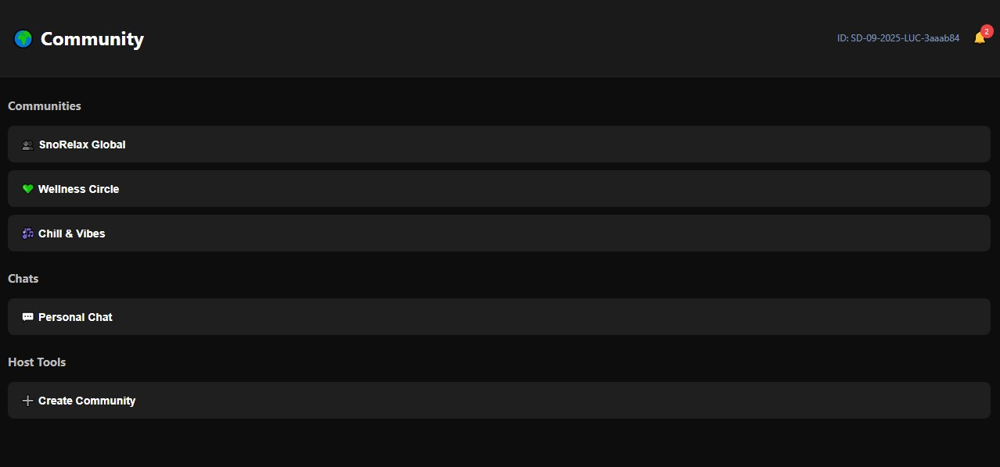

# SnoRelax Frontend


This is the frontend for **SnoRelax**, a mental wellness and community platform.  
Built with React, it provides a user-friendly interface for all core features.

---

## Table of Contents

- [Project Overview](#project-overview)
- [Features](#features)
- [Screenshots](#screenshots)
- [Setup Instructions](#setup-instructions)
- [Usage](#usage)
- [Deployment](#deployment)
- [Project Structure](#project-structure)
- [Authors](#authors)
- [Connected App Links](#connected-app-links)
- [License](#license)

---

## Project Overview

SnoRelax is a web application designed to support mental wellness through mood tracking, community engagement, and chatbot support. The frontend provides a responsive and interactive user experience.

---

## Features

- **User Registration & Login:**  
  Simple forms for user onboarding and authentication.

- **Mood Tracker:**  
  Users can log and visualize their mood history.

- **Community Dashboard:**  
  Admins can create and manage communities. Users can view and join communities.

- **Chatbot:**  
  Users can chat with a supportive bot for mental wellness.

- **Responsive Design:**  
  Works well on desktop and mobile devices.

- **API Integration:**  
  Connects seamlessly with the backend for all features.

---

## Screenshots

Below are some screenshots of the SnoRelax frontend:

### Login Page


### Dashboard


### Mood Tracker


### Community Page


### Chatbot


---

## Setup Instructions

1. **Clone the repository and install dependencies:**
   ```bash
   npm install
   ```

2. **Run locally:**
   ```bash
   npm start
   ```

3. **API Configuration:**  
   The frontend automatically connects to the correct backend URL for development and production.

---

## Usage

- Register or log in to access the dashboard.
- Track your mood and view analytics.
- Join or create communities (admin only).
- Chat with the built-in chatbot for support.

---

## Deployment

The frontend is hosted on Vercel:  
**[https://sno-relax-client.vercel.app/](https://sno-relax-client.vercel.app/)**

To deploy:
- Push your code to a Git repository.
- Connect the repo to [Vercel](https://vercel.com/).
- Set environment variables if needed.

---

## Project Structure

- `src/pages/` — Main pages (Login, Dashboard, etc.)
- `src/components/` — Reusable UI components (Chatbot, MoodTracker, etc.)
- `src/api.js` — API helper functions
- `public/` — Static assets

---

## Authors

- Shivam Kumar Dubey (Admin)
- Suryakant Mishra (Admin)

---

## Connected App Links

- **Frontend:** [https://sno-relax-client.vercel.app/](https://sno-relax-client.vercel.app/)
- **Backend:** [https://sno-relax-server-hostside.onrender.com/](https://sno-relax-server-hostside.onrender.com/)

---

## License

This project is for educational purposes as part of a final year project.  
[Specify your license here, e.g., MIT, if desired.]

---
